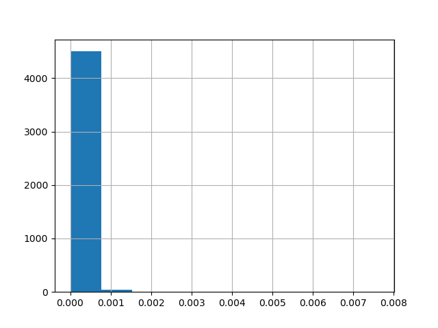

Análisis Dataset
================

Origen de datos
-----------------

* uno
* dos

Transformaciones
----------------

Explicación

Resultados
----------

Resumen

.. csv-table:: Estadísticas
    :file:  output/analisis_dataset/estadisticas.csv

Frecuencia de palabras en textos de ficción

